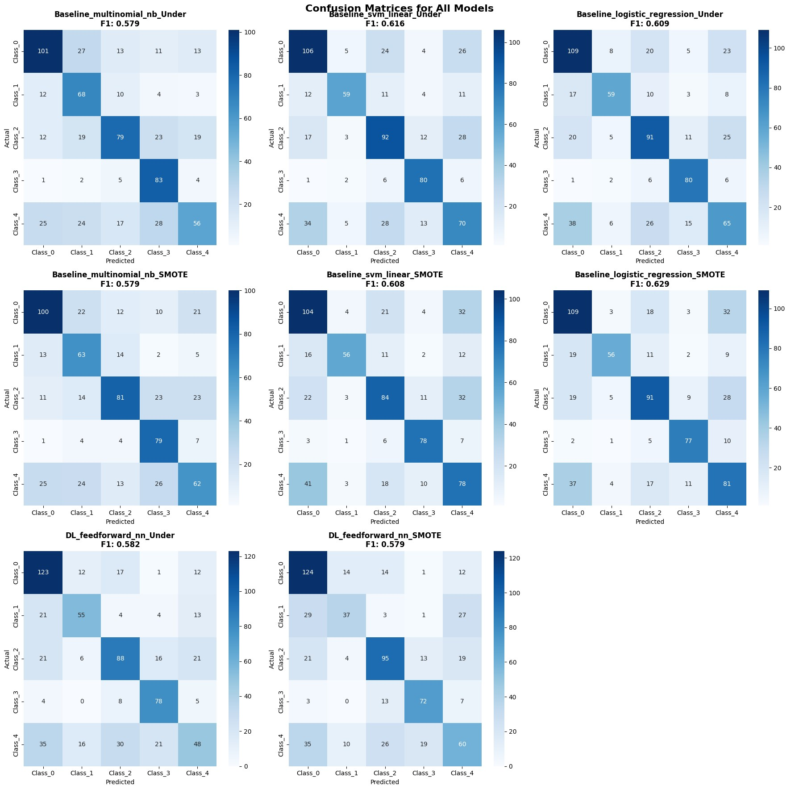

# FeelOut: Indonesian Text Emotion Classification


## Overview

FeelOut is an end-to-end emotion classification system for Indonesian text using the Indonesian Twitter Emotion Dataset. The project implements both traditional machine learning and deep learning approaches with comprehensive data preprocessing, model evaluation, and an interactive web interface.

## Dataset

**Source**: meisaputri21/Indonesian-Twitter-Emotion-Dataset  
**Content**: Indonesian Twitter posts labeled with emotional categories  
**Language**: Bahasa Indonesia

## Machine Learning Pipeline

### 1. Exploratory Data Analysis (EDA)
- Data distribution analysis and class imbalance examination
- Text length statistics and vocabulary analysis
- Emotion category frequency distribution
- Word frequency analysis per emotion class

### 2. Data Preprocessing
- Text cleaning: URLs, mentions, special characters removal
- Indonesian text normalization using custom abbreviation dictionary
- Tokenization and case normalization
- Stopword removal with Indonesian stopwords
- Stemming using Sastrawi Indonesian stemmer

### 3. Feature Engineering and Data Balancing

#### Baseline Approach: TF-IDF Vectorization
- Term Frequency-Inverse Document Frequency representation
- N-gram range: unigrams and bigrams
- Data balancing with SMOTE and undersampling techniques

#### Deep Learning Approach: Word Embeddings
- FastText Indonesian pre-trained vectors (300 dimensions)
- Mean pooling aggregation method
- Minimal preprocessing to preserve semantic information
- Data balancing with SMOTE and undersampling techniques

### 4. Model Development

#### Baseline Models (TF-IDF + Traditional ML)
- Multinomial Naive Bayes
- Linear Support Vector Machine
- Logistic Regression

#### Deep Learning Model
- Feedforward Neural Network with word embeddings
- Multi-layer architecture with dropout regularization

### 5. Model Training and Evaluation
- Data split: 70% training, 15% validation, 15% testing
- Stratified cross-validation
- Performance metrics: accuracy, precision, recall, F1-score
- Confusion matrix visualization
- Model comparison across balancing techniques



## Web Application

### Frontend
- React-based interface with real-time emotion classification
- Model selection between baseline and deep learning
- Indonesian text input with confidence visualization

### Backend
- Flask API with emotion prediction endpoints
- Dynamic model loading and text preprocessing
- RESTful API for frontend integration

## Installation and Usage

### 1. Model Training
First, run the Jupyter notebook to train and generate models:
```bash
cd ml
jupyter notebook doe.ipynb
# Run all cells in the main notebook (doe.ipynb)
```

### 2. Backend Setup
Install dependencies and start the Flask server:
```bash
cd backend
pip install -r requirements.txt
python main.py
```

### 3. Frontend Setup
Install dependencies and start the React application:
```bash
cd frontend
npm install
npm run dev
```

### 4. Access Application
- Backend API: http://localhost:8080
- Frontend Interface: http://localhost:3000

## API Endpoints

- `POST /api/predict` - Emotion classification endpoint
- `GET /api/models/status` - Model availability status
- `GET /api/health` - System health check

## Results

The system classifies Indonesian text into emotion categories including happiness, sadness, anger, fear, and love. Performance comparison between baseline TF-IDF models and deep learning approaches with different data balancing techniques provides insights for Indonesian emotion classification tasks.


## Technical Implementation

The project demonstrates complete machine learning workflow from data exploration through web deployment. Implementation includes Indonesian text preprocessing, multiple modeling approaches, systematic evaluation with confusion matrices, and a web interface for practical application.
